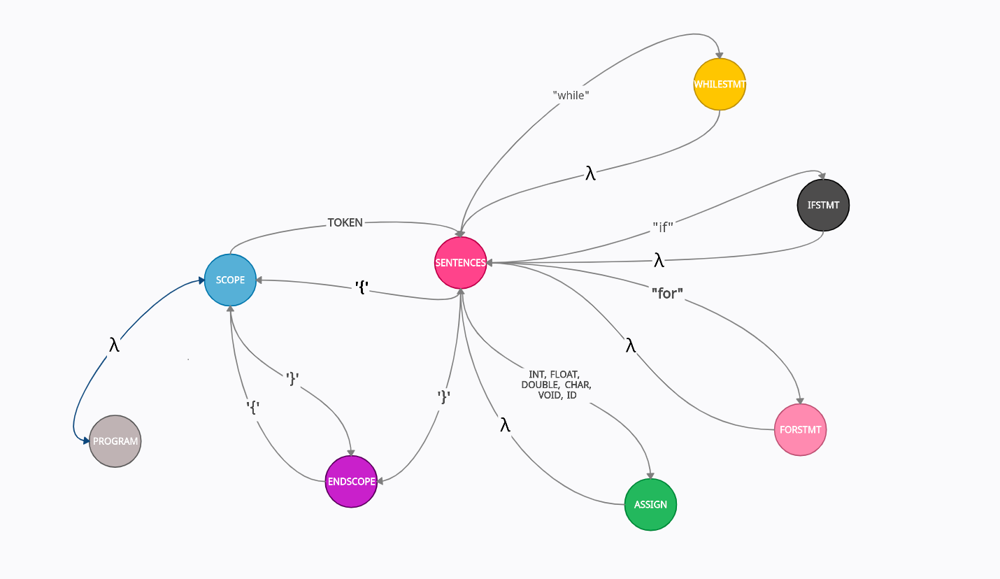

# PARSER
[Github](https://github.com/csergen/SPRING-2021/tree/main/programming-language/parser02)


- [Install docker on Linux](https://docs.docker.com/engine/install/)

## Build & Run:
```console 
  $ run.sh [ FOLDER_NAME_OF_INPUT_FILES ]  # ex: run.sh test
  
    or 
  
  $ run.sh d  # build and run with docker

  or

  $ gcc -o parser -I*.h parser.c
  $ ./parser or ./parser [INPUT_FILE_PATH]
```

### State Machine Diagram:


### Grammar:
```html
<program>: [int | void] main () <scope>

<sentences>: { <sentence> }

<sentence>: 
  <scope>       |
  <assign>      |
  <ifstmt>      |
  <forstmt>     |
  <whilestmt>   |

<type>:
  int | float | double | char | void

<id>: _a-Z
<number>: 0-9

<scope>: '{' <sentences> '}'

<assign>:
  [<type>] <id> ( = | += | -= | *= | /= ) <expression>

{* <conj> || <conj> || <conj> || ... *}
<expression>: <conj> { || <conj> }

{* <relation> && <relation> && <relation> && ... *}
<conj>: <relation> { && <relation> }

{* <addition> < <addition> <= <addition> > <addition> >= <addition> == <addition> != <addition>  .... *}
<relation>: <addition> { ( < | <= | > | >= | == | != ) <addition> }

{* <term> + <term> - <term> ..... *}
<addition>: <term> { (+ | -) <term> }

{* <negation> * <negation> / <negation> .... *}
<term>: <negation> { (* | /) <negation> }

{* !a | !0 *}
<negation>: ! <factor>

<factor>: <id> | <number> | <quote> | <dquote> 

<ifstmt>: if ({ <expression> }) <scope>
          { elseif ( { <expression> } ) <scope> }
          [ else <scope> ]

<forstmt>: for ([<assign>]; [<expression>]; [<assign>]) <scope>

<whilestmt>: while ( [<expression>] ) <scope>

<stringstmt>: " { <factor> }"

<iostmt>: printf | scanf ([<stringstmt> {, <id> }]);
```
